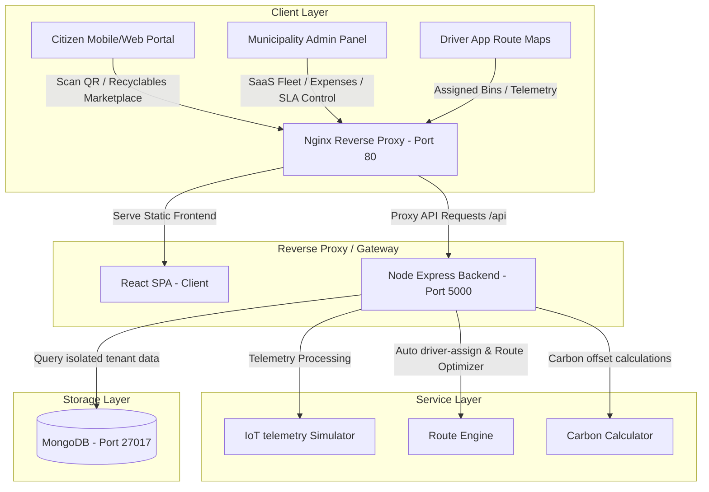

# 🌿 EcoWaste - Multi-Tenant AI-Powered Smart City Sustainability & Waste Platform

EcoWaste is an enterprise-grade, multi-tenant SaaS platform designed for modern municipalities to orchestrate smart waste collection, automate driver routes, audit operational expenses, and engage citizens with gamified recycling rewards and carbon analytics.

[](#)
[](#)
[](#)
[](#)

---

## 📋 Table of Contents
1. [System Architecture](#-system-architecture)
2. [Tech Stack](#-tech-stack)
3. [Features](#-features)
4. [Folder Structure](#-folder-structure)
5. [Getting Started & Local Development](#-getting-started--local-development)
6. [Production Docker Compose Deployment](#-production-docker-compose-deployment)
7. [Docker Hub Release Guides](#-docker-hub-release-guides)
8. [Environment Variables](#-environment-variables)
9. [API Endpoint Directory](#-api-endpoint-directory)
10. [Troubleshooting Guide](#-troubleshooting-guide)
11. [College Viva Deployment Checklist](#-college-viva-deployment-checklist)

---

## 🏗️ System Architecture



---

## 🛠️ Tech Stack

* **Frontend**: React 18, TypeScript, Recharts (Data analytics), React Leaflet (Interactive mapping), Tailwind CSS, Framer Motion (Premium animations).
* **Backend**: Node.js, Express.js REST API, Socket.IO (Real-time telemetry and alerts), Multer (Image reporting).
* **Database**: MongoDB (7.0 Alpine) with Mongoose ORM, GeoJSON spatial indexes.
* **DevOps**: Docker, Docker Compose, Nginx Gateway, multi-stage builder patterns.

---

## ✨ Features

* **Multi-Tenant SaaS Workspace**: Tenant isolation by organization ID, municipality configuration dashboard, custom subdomains, usage and limit tracking metrics.
* **Smart Bin IoT & Routing**: Live animated telemetry gauges, predictive linear regression overflow estimates, and optimized GPS collection route generation.
* **Citizen Sustainability Ecosystem**:
  * **Rewards & Badges**: QR check-ins, achievements progress, daily/weekly challenges.
  * **Carbon reports**: Calculated CO₂ offsets, aggregated community impact scores, and AI recommendations.
  * **Waste Trading**: Local P2P recyclables bids, scheduled pickup approvals, and moderator controls.
* **Municipality Fleet & Expenses**: Real-time vehicle telemetry, driver ratings, fuel efficiency charts, expense categories logs, and automatic SLA complaint escalations.

---

## 📁 Folder Structure

```
Assignment_7/
├── frontend/                # React TypeScript client
│   ├── src/
│   │   ├── components/      # Glassmorphic layout & reusable components
│   │   ├── pages/           # Pages (Smart Bin Dash, Sustainability, SaaS Ops)
│   │   ├── services/        # API services (sustainabilityApi, saasApi)
│   │   ├── types/           # TypeScript model definitions
│   ├── Dockerfile           # Optimized multi-stage client build
│   ├── nginx.conf           # Gateway reverse proxy configuration
├── backend/                 # Node.js API
│   ├── controllers/         # MVC endpoint controllers
│   ├── models/              # MongoDB Mongoose schemas
│   ├── routes/              # Express endpoint routers
│   ├── services/            # IoT simulator, Route Optimizer
│   ├── Dockerfile           # Lightweight Alpine production build
├── docker-compose.yml       # Complete stack orchestration file
└── README.md
```

---

## 🚀 Getting Started & Local Development

### Local Pre-requisites
* Node.js 18+ & npm 9+
* Local MongoDB instance running on `mongodb://localhost:27017/ecowaste`

### Step 1: Initialize Database
Seed default smart bins, driver profiles, and sustainability records:
```bash
cd backend
npm install
cp .env.example .env
npm run seed
```

### Step 2: Start Services
```bash
# Start backend API (runs on port 5000)
npm run dev

# Start frontend Client (runs on port 5173)
cd ../frontend
npm install
npm run dev
```

---

## 🐳 Production Docker Compose Deployment

We use a Docker Compose configuration including healthchecks, persistent volumes, restart policies, and custom isolated networks.

### Build and Start Stack
```bash
# Build and start all services in detached mode
docker-compose up --build -d

# Verify services status
docker-compose ps

# Monitor real-time logs
docker-compose logs -f
```
* **Frontend Access**: Available on port `80` (mapped to host).
* **Backend API**: Proxied by Nginx to Port `5000`.
* **MongoDB**: Persisted via `mongo_data` volume.

---

## 🏷️ Docker Hub Release Guides

Run these commands to tag and push the production images to your Docker Hub registry:

```bash
# 1. Login to Docker Hub
docker login

# 2. Build & Push Frontend Image
cd frontend
docker build -t <dockerhub-username>/smartwaste-frontend:latest .
docker push <dockerhub-username>/smartwaste-frontend:latest

# 3. Build & Push Backend Image
cd ../backend
docker build -t <dockerhub-username>/smartwaste-backend:latest .
docker push <dockerhub-username>/smartwaste-backend:latest
```

---

## ⚙️ Environment Variables

### Backend (`backend/.env`)
* `PORT`: Server port (Default: `5000`)
* `MONGO_URI`: MongoDB connection string (`mongodb://localhost:27017/ecowaste`)
* `JWT_SECRET`: Security salt for tokens
* `JWT_EXPIRE`: Token duration (Default: `30d`)

### Frontend (`frontend/.env`)
* `VITE_API_URL`: Root path for API requests (Default: `/api`)

---

## 📡 API Endpoint Directory

### Multi-Tenant SaaS Operations (`/api/saas`)
* `POST /tenant/register`: Register new municipality organization.
* `GET /tenant/info`: Get settings for authenticated tenant workspace.
* `POST /fleet/vehicles` / `GET /fleet/vehicles`: Add or list fleet vehicles.
* `POST /fleet/drivers` / `GET /fleet/drivers`: Add or view driver telemetry.
* `POST /expenses` / `GET /expenses`: Log or list operational costs.
* `GET /analytics/kpis`: View ward-wise KPI charts and volume trends.
* `GET /analytics/ai-forecast`: Get waste generation predictions and seasonal trend factors.
* `POST /automation/trigger`: Trigger automated driver assignment & SLA escalation rules.

### Citizen Sustainability (`/api/sustainability`)
* `GET /missions`: Get active daily and weekly challenges.
* `POST /verify-qr`: Verify physical bin deposits and award reward points.
* `GET /carbon/report`: Retrieve carbon footprint savings statistics.
* `GET /marketplace/listings`: List P2P waste marketplace trade offers.
* `POST /marketplace/listings/:id/bids`: Place bids on recyclable waste listings.

---

## 🛠️ Troubleshooting Guide

1. **MongoDB Connection Failures**: If backend container fails to start, ensure no other service is binding port `27017` on your host. Check logs via `docker logs ecowaste-mongodb`.
2. **Nginx 502 Bad Gateway**: Occurs when Nginx starts before the backend is healthy. The compose file handles this via the `condition: service_healthy` dependency checker.
3. **CORS Policy Errors**: Ensure the `CLIENT_URL` in backend env matches your client domain.

---

## 🎓 College Viva Deployment Checklist

Refer to the included [VIVA_CHECKLIST.md](file:///d:/Assignment_7/VIVA_CHECKLIST.md) in the workspace for step-by-step evaluation tests and questions to nail your project presentation!
